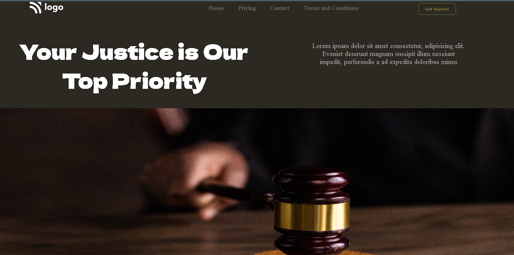

# Assignment-3

# Project [Deployed Link](https://deepakproject03.netlify.app)

- What I learned from this Project?
  - 
  - How to use HTML and CSS to create a beutiful website.
  - How to add background and position them accordingly.
  - CSS position property.
  - How to use margin and padding.
  - How to create navbar using flex.
  - How to use different Google Fonts in webpage.
  

 
---

## Time taken to finish this project

- 3 hour to complete it.

---

## ScreenShot

